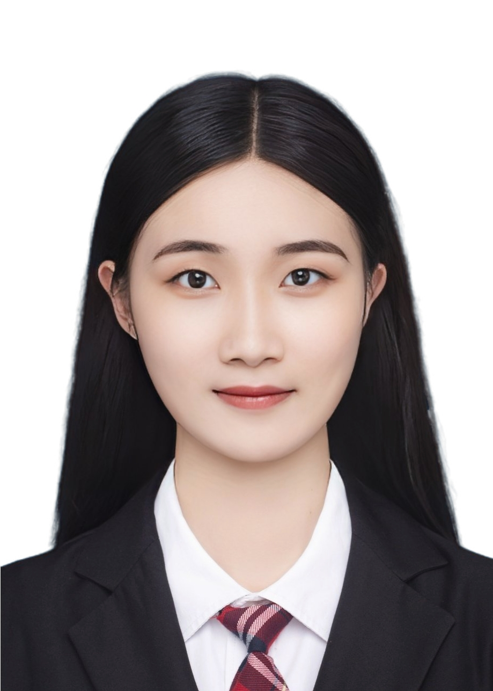

## 协作开发 | 个人介绍

**组员：李书慜，汪凌云，王静蕾，张迎娣**

---
### 组员1
#### 姓名
李书慜

#### 教育背景
+ 学院：华中师范大学计算机学院
+ 专业：计算机科学与技术（基地班）

#### 联系方式
+ qq：2732935897
+ 电话：15972597326
+ 邮箱：lishuminer@mails.ccnu.edu.cn

----
#### 个人介绍
##### 1.性格特点
内向、独立思考、细心负责、好奇心强

##### 2.兴趣爱好
阅读、运动、旅行、音乐

##### 3.技能专长
掌握c，c++，java，html，css，js，python等程序语言，了解深度学习相关知识。

---
### 组员2
#### 姓名
汪凌云

#### 教育背景
+ 学院：华中师范大学计算机学院
+ 专业：计算机科学与技术（基地班）

#### 联系方式
+ qq：2748160551
+ 电话：15623095233
+ 邮箱：2748160551@qq.com

----
#### 个人介绍
##### 1.性格特点
外向、独立思考、好奇心强

##### 2.兴趣爱好
阅读、观影、摄影、写作

##### 3.技能专长
掌握c，c++，python等程序语言，了解深度学习、机器学习等相关知识。

---
### 组员3
#### 姓名
王静蕾

#### 教育背景
+ 学院：华中师范大学计算机学院
+ 专业：计算机科学与技术（基地班）

#### 联系方式
+ qq：3680468275@qqcom
+ 电话：15972597326
+ 邮箱：wjlljw@mails.ccnu.edu.cn

----
#### 个人介绍
##### 1.性格特点
易燃易爆炸

##### 2.兴趣爱好
阅读、影音、美食

##### 3.技能专长
掌握c，c++，java，html，css，js，python等程序语言，了解深度学习、语音识别、大数据等相关知识，熟悉使用Linux,windows操作系统。目前对于使用有效提示词训练ChatGPT提高学习工作效率很感兴趣

---
### 组员4
#### 姓名
张迎娣

#### 教育背景
+ 学院：华中师范大学计算机学院
+ 专业：计算机科学与技术（基地班）

#### 联系方式
+ qq：2645636610
+ 电话：15671255378
+ 邮箱：2645636610@qq.com

----
#### 个人介绍
##### 1.技能专长

语言技能：英语CET6

专业技能：掌握c，c++，html，css，js，python等程序语言，了解深度学习相关知识如深度学习、人工智能程序设计、自然语言处理等

学术认证：华为技术有限公司“Kunpeng-Developer HCIP”认证

##### 2.获奖情况

2021年09月，获评2021年校级“三好学生”

2021年10月，获评国家励志奖学金

2021年12月，获评校级“暑期社会实践先进个人”

2022年04月，获评校级“优秀共青团员”称号

2022年09月，获评2022年校级“三好学生”

2022年10月，获国家励志奖学金、华为奖学金

2022年12月，获评华中师范大学“优秀志愿者”称号

2023年01月，获第十四届全国大学生数学竞赛（非数学类）二等奖

2023年01月，获第十一届湖北省大学生数学竞赛（非数学类）二等奖

---

